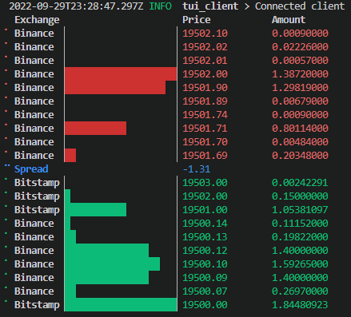

# Universal orderbook streamer



This project consists of 3 crates:
* `data-streamer`: streams the orderbook-snapshots data for the desired pair.
* `server`: calls `data-streamer` and receives and processes the orderbooks to send them through gRPC.
* `client`: TUI to visualize the gRPC responses from the `server`.

## Warning! ⚠️ 
As of today, 13-Sep-2022, this project uses the most recent version of [tonic](https://docs.rs/tonic/latest/tonic/) which requires having the binary of [protoc](https://github.com/protocolbuffers/protobuf/releases/tag/v21.5) installed in your machine.
Run the following command to make sure you have it. If not, it's as simple as downloading the  [protoc](https://github.com/protocolbuffers/protobuf/releases/tag/v21.5) specific to your machine and adding the binary to your `PATH`.
```sh
protoc --version
```
Read more about this issue [here](https://github.com/hyperium/tonic/issues/1047).
## To run the project: 
### Server
```sh
cargo run --release -p server -- --base btc --quote usd
```

### Client
```sh
cargo run --release -p client --bin tui_client
```

## Potential improvements
* Normalize the subscriptions to exchanges with a common `trait`. So each subscription follows the same pattern.
* The challenge is based on orderbook-snapshots. This is suboptimal as the updates come every 100ms. If the goal is to reduce latency, orderbook-updates streams should be used.
* Verify the ticker is available on the exchanges to be streamed from. To solve this, pull all the pairs from the implemented exchanges and save them in a database. When requesting for a pair, check first if it exists in the database, otherwise panic or only stream the available exchanges letting the user know which ones are not available. 
* Unit tests per function and integration tests per connection/stream.
* Proper error handling, logging, comments
* Add env variables to update urls and other inputs from there.
* Server streams multiple pairs so the Client can request subscribing to any desired pair.
* Rate limiting